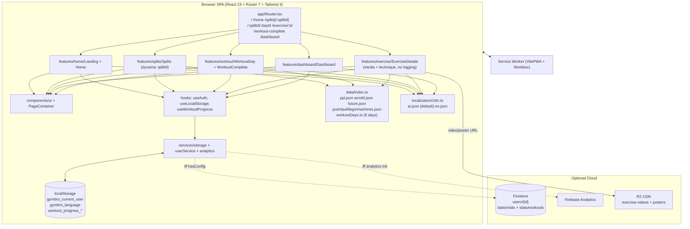
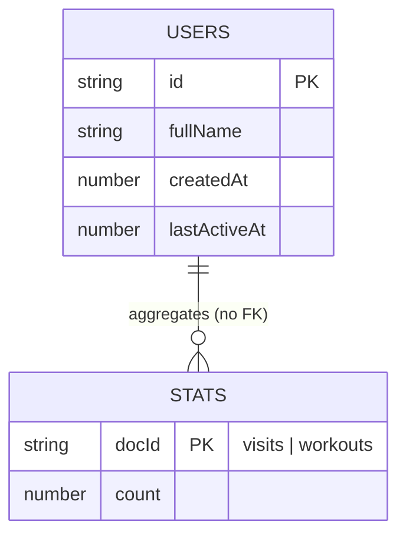

# GymBro — Comprehensive Technical Documentation

> Base: actual codebase at `D:\GymBro` (branch `master`, Vite + React + TypeScript + Firebase).
> All statements are grounded in files present in the repo. Where something does not exist (tests, backend API, CI config), that is stated explicitly.
> Last updated: after Arnold Split enablement + Weight Logger removal (build: 509 modules, `tsc` clean).

---

## Table of Contents

1. [Project Overview](#1-project-overview)
2. [Architecture & Structure](#2-architecture--structure)
3. [Setup & Installation](#3-setup--installation)
4. [Core Modules / Components](#4-core-modules--components)
5. [API Documentation](#5-api-documentation)
6. [Database Schema](#6-database-schema)
7. [Configuration & Deployment](#7-configuration--deployment)
8. [Known Issues, TODOs & Technical Debt](#8-known-issues-todos--technical-debt)
9. [Glossary](#9-glossary)

---

## 1. Project Overview

### 1.1 What it does

**GymBro** is a mobile-first, installable **PWA (Progressive Web App)** that acts as an **educational workout guide** for gym members.

Core user journey (verified in `src/app/Router.tsx`, `src/features/`):

1. `Landing (/)` — animated welcome screen → enter full name (no password).
2. `Home (/home)` — greeting + list of workout splits (PPL + Arnold enabled, rest "coming soon").
3. `Splits (/splits/:splitId)` — day cards for the selected split (legacy `/splits` defaults to PPL).
4. `WorkoutDay (/:splitId/:dayId)` — exercise checklist with progress bar; checkbox per exercise; "complete" CTA when all done (legacy `/ppl/:dayId` still works).
5. `ExerciseDetails (/exercise/:id)` — video/poster hero (or anatomical GIF fallback), sets × reps × rest × difficulty, primary/secondary muscles, equipment, step-by-step technique (setup / execution / breathing / ROM), common mistakes, coach tips. (Weight logging and rest timer were removed — see §8.)
6. `WorkoutComplete (/workout-complete)` — summary (exercises completed, duration, %).
7. `Dashboard (/dashboard)` — admin-ish stats from Firestore (total users, active today, visits, completions).

Purpose (from PWA manifest in `vite.config.ts:13-20` and `index.html:8`):

> `Educational workout application for intermediate and advanced gym members`

### 1.2 Target users

- Arabic-speaking (Egyptian dialect default), English as secondary language.
- Gym-goers following a Push-Pull-Legs or Arnold split.
- Users on mobile browsers who benefit from installable PWA + offline caching.
- No coach account, no social features — single-user local experience with optional cloud aggregation.

### 1.3 High-level architecture (plain language)

- **Client-only SPA.** No custom backend server. React renders everything in the browser.
- **Content is data-driven.** Exercises, splits, and workout days are static JSON (`src/data/`). UI text is never hardcoded; it is looked up via i18n keys (`src/localization/locales/*.json`). Two splits are enabled (`ppl`, `arnold`); three remain disabled placeholders.
- **Storage is local-first.** Workout progress lives in `localStorage` (`workout_progress_*`; user/lang use the `gymbro_` prefix). Firebase Firestore + Analytics are **optional enhancements**: if `VITE_FIREBASE_API_KEY` + `PROJECT_ID` are missing, the app still fully works (`src/services/firebase.ts:15`, `hasConfig` guard).
- **Pseudo-identity, not auth.** "Login" = `crypto.randomUUID()` + name stored locally and (best-effort) in Firestore `users/{id}`. No Firebase Auth, no passwords, no sessions.
- **PWA shell.** `vite-plugin-pwa` generates a service worker; Firestore reads use `NetworkFirst` cache (`vite.config.ts:37-46`). Exercise GIFs/MP4s load on demand and are never precached.
- **Dynamic split routing.** Routes are parameterized by `splitId`/`dayId`; adding a future split needs data + locale entries, with only the legacy `/splits` default (`ppl`) still hardcoded.

### 1.4 Tech stack

| Layer | Technology | Version (from `package.json`) |
|---|---|---|
| Language | TypeScript | `^5.9.3` (`target ES2020`, `jsx: react-jsx`, `strict: true`) |
| UI | React / React-DOM | `^19.2.8` |
| Routing | React Router DOM | `^7.18.1` (`BrowserRouter`) |
| Animation | Framer Motion | `^12.42.2` |
| i18n | i18next / react-i18next | `^24.2.3` / `^15.7.4` |
| Styling | Tailwind CSS / @tailwindcss/vite | `^4.3.3` |
| Backend (optional) | Firebase (app, firestore, analytics) | `^11.10.0` |
| Build | Vite / @vitejs/plugin-react | `^6.4.3` / `^4.7.0` |
| PWA | vite-plugin-pwa / workbox-window | `^1.3.0` / `^7.4.1` |
| Lint | ESLint | `^9.39.5` |
| Types | @types/react, @types/react-dom | `^19.2.17`, `^19.2.3` |
| Asset tooling (optional, local only) | Python 3.14 + PIL / numpy / imageio (+ imageio-ffmpeg) | PIL `12.1.1` (machine has Python 3.13/3.14, not on PATH) |

TS config (`tsconfig.json`): `moduleResolution: bundler`, `baseUrl: .`, `paths: @/* → src/*`, `noUnusedLocals`, `noUnusedParameters`, `noFallthroughCasesInSwitch`, `noUncheckedIndexedAccess`, `include: [src, vite-env.d.ts]`.

No test framework, no test scripts, no `*.test.*` / `*.spec.*` files found.

---

## 2. Architecture & Structure

### 2.1 Folder / file breakdown

```
D:\GymBro\
  index.html                  # RTL default (<html lang="ar" dir="rtl">), #root, /src/main.tsx
  vite.config.ts              # @ alias, Tailwind, VitePWA manifest + workbox
  tsconfig.json               # strict TS, @/* paths
  package.json                # dev, build (tsc -b && vite build), lint, preview
  .env.example                # 7x VITE_FIREBASE_* placeholders
  .gitignore                  # node_modules, dist, .env, *.local, skill-output.txt
  start.bat                   # Windows launcher: npx vite --host --port 5173
  doc.md                      # this file (consolidated documentation)
  docs/                       # split per-section docs (may lag behind doc.md)
  .agents/skills/slack-gif-creator/  # project-scope agent skill (GIF tooling knowledge + core/)
  public/
    _headers                  # Cloudflare Pages headers (nosniff, GIF/PNG MIME, immutable assets)
    favicon.svg, icon-192.svg, icon-512.svg
    exercises/*.gif           # 15 anatomical GIFs (14 originals + pec-deck-fly, see §2.5)
    icons/icon-192.png, icon-512.png
  scripts/
    check_video.py            # one-off: curl R2 MP4, inspect frames with imageio
    generate_gifs.py          # batch converter: R2 MP4 → crop → 480x360 15fps GIF (64 colors)
  src/
    main.tsx                  # StrictMode + createRoot + import ./localization/i18n
    App.tsx                   # Suspense spinner → <Router/>
    index.css                 # Tailwind v4 @theme tokens + base + utilities
    app/Router.tsx            # /splits/:splitId + /:splitId/:dayId dynamic; legacy /splits, /ppl/:dayId kept
    types/index.ts            # User, Split, WorkoutDay, Exercise, TechniqueSection, WorkoutProgress, ...
    data/
      index.ts                # exerciseMap + getters (ppl + arnold registered)
      workoutDays.ts          # 6 WorkoutDay objects (3 PPL + 3 Arnold)
      splits/ppl.json         # {id:ppl, enabled:true, days:[...]}
      splits/arnold.json      # {id:arnold, enabled:true, days:[...], icon:'⚔️'}
      splits/future.json      # 3 disabled splits (upper-lower, bro-split, full-body)
      exercises/push.json     # 5 exercises
      exercises/pull.json     # 5 exercises
      exercises/legs.json     # 6 exercises
      exercises/machines.json # 5 Arnold machine exercises (4 reuse GIFs, 1 has R2 video)
    localization/
      i18n.ts                 # init, localStorage lang detection, dir switching
      locales/ar.json         # default + fallbackLng (Egyptian dialect)
      locales/en.json         # mirror structure
    services/
      firebase.ts             # lazy init app/db/analytics + hasConfig
      storage.ts              # getItem/setItem/removeItem with gymbro_ prefix
      userService.ts          # local user + Firestore users/stats
      analytics.ts            # logEvent wrappers
    hooks/
      useAuth.ts              # user state + login/updateUser/refreshLastActive
      useLocalStorage.ts      # generic useState+localStorage (raw keys, no prefix)
      useWorkout.ts           # useWorkoutProgress only (useWeightLogs removed)
    features/
      home/Landing.tsx        # entry + name capture
      home/Home.tsx           # split list → /splits/:splitId
      splits/Splits.tsx       # dynamic splitId (params → state → 'ppl' default)
      workout/WorkoutDay.tsx  # dynamic splitId/dayId checklist + progress
      workout/WorkoutComplete.tsx
      exercise/ExerciseDetails.tsx  # media + stats + technique (no weight logging)
      dashboard/Dashboard.tsx
    components/
      layout/PageContainer.tsx
      ui/Button.tsx, Card.tsx, Badge.tsx, Checkbox.tsx, ProgressBar.tsx
    utils/                    # EMPTY (no files)
    assets/gifs/, assets/images/  # EMPTY (GIFs live in public/exercises/)
```

Removed (Weight Logger feature): `src/features/exercise/WeightLogger.tsx`, `src/features/exercise/RestTimer.tsx`, `useWeightLogs`, `WeightLog`/`WeightSet` types, 8 weight-logging locale keys per language. Also removed: `scripts/generate_arnold_gifs.py` (its flat-2D output was rejected; see §2.5).

Path alias: `@` → `./src` (`vite.config.ts:50-54`, `tsconfig.json:20-22`).

### 2.2 Data flow

**A. First run / identity**

```
Landing → getLocalUser() [key gymbro_current_user]
  ├─ exists → navigate('/home')
  └─ missing → useAuth.login(name) → userService.createUser()
       ├─ id = crypto.randomUUID(), now = Date.now()
       ├─ if hasConfig: setDoc(users/{id}, user).catch(()=>{})
       ├─ saveLocalUser(user)
       └─ trackVisit()  (analytics user_visit)
```

`useAuth.ts:9-13` fires `updateLastActive(user.id)` on every `user` identity change.

**B. Browse content (fully offline)**

```
Home → getAllSplits() → [ppl, arnold, + 3 future]
Splits (/splits/:splitId) → getSplitById(id) → getWorkoutDaysBySplit(id) sorted by dayOrder
WorkoutDay (/:splitId/:dayId) → getWorkoutDayById(`${splitId}/${dayId}`) → getExercisesByWorkoutDay(day.id)
ExerciseDetails → useParams id → getExerciseById(id) → t(nameKey), t(technique.*)
```

Every domain object stores i18n keys (`nameKey`, `descriptionKey`, `primaryMuscleKey`, `technique.*`), resolved at render with `t(key)`.

**C. Session state (localStorage only)**

```
WorkoutDay → useWorkoutProgress(day.id)
  key workout_progress_{dayId}, value {dayId, date, completedExercises[], startTime, endTime?, completed}
  toggleExercise(id) → checkbox add/remove (per-exercise completion happens here)
WorkoutComplete (location.state {day, progress})
  → incrementWorkoutCompletion() → stats/workouts increment(1)
  → trackWorkoutComplete(day.id)
```

There is no per-set weight tracking; exercise completion is toggled from the WorkoutDay checklist.

**D. Telemetry / dashboard (best-effort Firestore)**

```
getDashboardStats(): users.size, where(lastActiveAt >= midnight) count,
  orderBy(lastActiveAt desc) limit(10), stats/visits, stats/workouts.
mostViewedExercises always [].
```

### 2.3 Key design patterns

| Pattern | Where | Why |
|---|---|---|
| Feature colocation | `src/features/*` | Each route owns its UI; shared primitives in `components/ui` |
| Data-driven content | `src/data/**/*.json` + getters | Add exercise = JSON edit only; new split = JSON + locale + day records |
| Indirect text via keys | `*Key` fields on all domain objects | AR/EN + RTL/LTR without code change (99 Arnold keys verified in both locales) |
| Dynamic split routing | `/:splitId/:dayId`, `/splits/:splitId` (+ legacy PPL paths) | Split-specific pages without per-split components; static routes outrank dynamic ones |
| Local-first + graceful degradation | `hasConfig` + try/catch | Works with zero env config; Firebase only enhances |
| Prefixed sync storage | `services/storage.ts` (`gymbro_`) | Avoid collisions; JSON-safe silent fallback |
| Generic reactive storage | `hooks/useLocalStorage.ts` | `useState` + `localStorage` in one API |
| Atomic UI kit | `Button, Card, Badge, Checkbox, ProgressBar, PageContainer` | Consistent dark theme + motion; `Card` doubles as button when `onClick` set |
| Anatomical media fallback chain | `videoUrl` (R2 MP4) → `gifPath` (local) → emoji placeholder | New machine exercises reuse verified GIFs; no invented CDN URLs |
| PWA NetworkFirst | `vite.config.ts:37-46` | Offline-tolerant Firestore reads (50 entries / 24h); media never precached |
| Fire-and-forget telemetry | `analytics.ts`, `userService.ts` | Analytics must never break workout UX |

### 2.4 Architecture diagram



### 2.5 Exercise media pipeline (anatomical style)

All user-facing exercise visuals use the white-background 3D anatomical model style (model with red highlighted muscles). Sources:

- **R2 CDN** (`https://pub-585d42eb…r2.dev/exercise-videos/male/*.mp4` + `exercise-posters/male/*.jpg`): 16 videos/posters, all verified HTTP 200.
- **Local GIF fallbacks** (`public/exercises/*.gif`): 15 files. Converted from R2 MP4s per `scripts/generate_gifs.py` (center 4:3 crop → 480×360 LANCZOS → every 2nd frame ≈ 15fps → 64-color global palette). `pec-deck-fly.gif` (827 KB, 60 frames) was converted from the verified `dumbbell-fly.mp4` the same way.
- **Probing policy**: 27 candidate R2 filenames were HEAD-checked for machine exercises; only `dumbbell-fly` existed. No URLs are invented — entries without R2 footage omit `videoUrl`/`posterUrl` and reuse a verified local GIF:

| Exercise | `videoUrl` / `posterUrl` | `gifPath` |
|---|---|---|
| `machine-chest-press` | — | `/exercises/barbell-bench-press.gif` |
| `incline-machine-press` | — | `/exercises/incline-dumbbell-press.gif` |
| `chest-supported-machine-row` | — | `/exercises/barbell-row.gif` |
| `seated-cable-row` | — | `/exercises/barbell-row.gif` |
| `pec-deck-fly` | `dumbbell-fly.mp4` / `.jpg` (both 200) | `/exercises/pec-deck-fly.gif` |

Rejected approach (documented so it isn't repeated): flat 2D canvas animations via `slack-gif-creator` primitives do not match the app's anatomical style; the generator script was deleted. The installed skill remains useful for its `GIFBuilder`/quantization utilities, not for drawing exercise art.

---

## 3. Setup & Installation

### 3.1 Prerequisites

| Need | Details |
|---|---|
| Node.js + npm | Recent LTS that runs Vite 6. No `.nvmrc` / `engines` field in repo. |
| Browser | Modern Chromium/Safari/Firefox (PWA, `crypto.randomUUID`, `100dvh`). (`AudioContext` no longer used — rest timer removed.) |
| Firebase account | **Optional.** Only for cloud persistence + Dashboard numbers. App is fully usable without it. |
| R2 CDN | No key needed; MP4/poster URLs are public. |
| Python (asset tooling only) | Local Python 3.14 + `PIL 12.1.1`, `numpy`, `imageio`, `imageio-ffmpeg` — used to convert R2 MP4s to GIFs. Not on PATH by default; invoke via full path. Run Python with `PYTHONUTF8=1` on Windows (skill prints `✓`). |
| OS note | `start.bat` is Windows-only. |

### 3.2 Step-by-step local setup

```bash
# 1. clone
git clone <repo-url>
cd GymBro

# 2. install
npm install

# 3. configure (optional — skip for offline/local mode)
copy .env.example .env
# macOS/Linux: cp .env.example .env
# then fill values (see §3.3)

# 4. typecheck
npx tsc --noEmit

# 5. dev server
npm run dev
# → http://localhost:5173/
# Windows alternative: start.bat  (npx vite --host --port 5173)

# 6. production build + preview
npm run build     # tsc -b && vite build → dist/
npm run preview

# 7. lint
npm run lint      # eslint .
```

Same core commands are documented in `AGENTS.md`. Agent skills: `slack-gif-creator` is installed at project scope (`.agents/skills/`) and global (`~/.claude/skills`) — no setup needed to use it.

### 3.3 Environment variables

All `VITE_`-prefixed (exposed via `import.meta.env`). Source: `.env.example` + `src/services/firebase.ts:5-13`.

| Variable | Purpose | Example |
|---|---|---|
| `VITE_FIREBASE_API_KEY` | Enables Firebase init (gate 1 of `hasConfig`) | `AIzaSy...` |
| `VITE_FIREBASE_AUTH_DOMAIN` | Stored in config; Auth SDK not actually imported | `gymbro-xxx.firebaseapp.com` |
| `VITE_FIREBASE_PROJECT_ID` | Gate 2 of `hasConfig`; Firestore selector | `gymbro-prod` |
| `VITE_FIREBASE_STORAGE_BUCKET` | Stored only; Storage SDK not used | `gymbro-xxx.appspot.com` |
| `VITE_FIREBASE_MESSAGING_SENDER_ID` | Stored only; FCM not used | `1234567890` |
| `VITE_FIREBASE_APP_ID` | Firebase app identifier | `1:123:web:abc...` |
| `VITE_FIREBASE_MEASUREMENT_ID` | Analytics property id | `G-XXXXXXX` |

Behavior matrix:

- Both `API_KEY` and `PROJECT_ID` set → `hasConfig=true` → `initializeApp`, `getFirestore`, `getAnalytics`.
- Either missing → `app/db/analytics = null`; service calls early-return or swallow; Dashboard shows zeros.

> Security note: these are public client keys by design (Firebase web config). Restrict via Firebase console (API restrictions + Firestore rules), not secrecy.

### 3.4 Tests

**None.** No test runner, no `test` script, no `*.test.*` files. Verification is:

```bash
npx tsc --noEmit   # type gate (also runs as part of npm run build)
npm run lint       # eslint
npm run build      # full production bundle gate (currently 509 modules, clean)
```

---

## 4. Core Modules / Components

### 4.1 `src/types/index.ts` — domain model

```ts
User { id: string; fullName: string; createdAt: number; lastActiveAt: number }
Split { id; nameKey; descriptionKey; enabled: boolean; days: string[]; icon?: string }
WorkoutDay { id; splitId; nameKey; descriptionKey; estimatedDuration: number;
  targetMuscles: string[]; exerciseIds: string[]; dayOrder: number }
Exercise { id; nameKey; gifPath?; videoUrl?; posterUrl?; primaryMuscleKey: string;
  secondaryMusclesKey: string[]; difficulty: Difficulty; equipment: string[];
  sets: number; reps: string; restTime: string; technique: TechniqueSection;
  commonMistakes: string[]; coachTips: string[] }
TechniqueSection { setup: string[]; execution: string[]; breathing: string[]; rangeOfMotion: string[] }
WorkoutProgress { dayId; date; completedExercises: string[]; startTime: number; endTime?: number; completed: boolean }
DashboardStats { totalUsers; activeUsersToday; totalVisits;
  mostActiveUsers: {name;count}[]; workoutCompletionCount; mostViewedExercises: {name;views}[] }
Difficulty = 'beginner'|'intermediate'|'advanced'; Language = 'ar'|'en'
```

(`WeightLog`/`WeightSet` were removed with the Weight Logger.) Rule: everything user-visible is a **key** (e.g. `exercises.squat.name`), never a literal. New equipment keys (`chestPressMachine`, `rowMachine`, `pecDeck`) are declared in both locales.

### 4.2 `src/data/index.ts` — content access layer

In-memory `Map<string, Exercise>` built once from push/pull/legs/machines JSON (21 exercises).

| Function | Signature | Notes |
|---|---|---|
| `getEnabledSplits` | `() => Split[]` | `[ppl, arnold]` filtered by `enabled`. |
| `getAllSplits` | `() => Split[]` | `[ppl, arnold, ...future]` → enabled + coming-soon cards. |
| `getSplitById` | `(id: string) => Split \| undefined` | ppl → arnold → future lookup. |
| `getWorkoutDaysBySplit` | `(splitId: string) => WorkoutDay[]` | `filter(d => d.splitId === splitId)`. |
| `getWorkoutDayById` | `(id: string) => WorkoutDay \| undefined` | Exact match, e.g. `ppl/push`, `arnold/legs`. |
| `getExerciseById` | `(id: string) => Exercise \| undefined` | `exerciseMap.get(id)`. |
| `getExercisesByIds` | `(ids: string[]) => Exercise[]` | Drops missing (`filter(Boolean)`). |
| `getExercisesByWorkoutDay` | `(dayId: string) => Exercise[]` | `[]` if day missing. |

```ts
import { getExercisesByWorkoutDay } from '@/data';
const chestBack = getExercisesByWorkoutDay('arnold/chest-and-back'); // 6 exercises
```

To add content: append to an `exercises/*.json` → add id to `workoutDays.ts → exerciseIds` → add `*Key` strings to `ar.json` + `en.json`. New split: `splits/<id>.json` + registry + day records + locales (routes adapt automatically).

### 4.3 Data files

- `workoutDays.ts`: 6 days. PPL — Push (60 min, 5 ex), Pull (55 min, 5 ex), Legs (60 min, 6 ex). Arnold — chest-and-back (65 min, chest/back, 6 ex alternating machines + `lat-pulldown`), shoulders-and-arms (60 min, shoulders/biceps/triceps, 6 ex), legs (60 min, 6 ex).
- `splits/ppl.json`: `{id:'ppl', enabled:true, ...}`. `splits/arnold.json`: `{id:'arnold', enabled:true, days:[3 arnold day IDs], icon:'⚔️'}`.
- `splits/future.json`: 3 disabled placeholders (`upper-lower`, `bro-split`, `full-body`, `days:[]`).
- Exercise JSON: `sets` number, `reps` range string (`"8-12"`), `restTime` (`"90s"` machines, `"120s"` others) shown as prescription info.
- Media priority (`ExerciseDetails.tsx`): `videoUrl` (R2 MP4 autoplay/muted/loop) → `gifPath` (local) → emoji placeholder. Machine entries without R2 footage omit `videoUrl`/`posterUrl` (see §2.5 table).
- 21 exercises total: 16 PPL + 5 machines (`machine-chest-press`, `incline-machine-press`, `chest-supported-machine-row`, `pec-deck-fly`, `seated-cable-row`).

### 4.4 Services

**`services/storage.ts`** — sync JSON localStorage with `gymbro_` prefix:

```ts
getItem<T>(key: string): T | null
setItem<T>(key: string, value: T): void
removeItem(key: string): void
```

**`services/firebase.ts`** — conditional init. Exports `{app, db, analytics, hasConfig}`.

**`services/userService.ts`**

| Function | Signature | Notes |
|---|---|---|
| `getLocalUser` | `() => User \| null` | reads `gymbro_current_user` |
| `saveLocalUser` | `(user: User) => void` | overwrite local |
| `clearLocalUser` | `() => void` | defined, never called (no logout UI) |
| `createUser` | `(fullName: string) => Promise<User>` | UUID + timestamps; best-effort `setDoc(users/{id})`; saves locally + `trackVisit()` |
| `updateLastActive` | `(userId: string) => Promise<void>` | best-effort `updateDoc`; syncs local; `trackVisit()` |
| `incrementVisitCount` | `() => Promise<void>` | `stats/visits` increment; **never called** |
| `incrementWorkoutCompletion` | `() => Promise<void>` | `stats/workouts` increment; called on `WorkoutComplete` mount |
| `getDashboardStats` | `() => Promise<DashboardStats>` | 3 parallel reads + 2 ordered queries; zeros when offline/error |

**`services/analytics.ts`** — `logEvent` wrappers, no-op when `analytics == null`:

```ts
trackEvent(name, params?) / trackPageView(pageName) / trackExerciseView(id)
trackWorkoutStart(dayId) / trackWorkoutComplete(dayId) / trackVisit()
```

Actually invoked: `trackExerciseView`, `trackWorkoutComplete`, `trackVisit`.

### 4.5 Hooks

**`useLocalStorage<T>(key, initialValue)`** (`hooks/useLocalStorage.ts`): lazy init from `localStorage.getItem(key)` (**raw key, no `gymbro_` prefix**). Functional updates supported. Silent on quota errors.

**`useAuth()`** (`hooks/useAuth.ts`): `{user, loading, login, updateUser, refreshLastActive}`. `login(fullName)` → `createUser` → `setUser`. Effect: `updateLastActive(user.id)` on `user` change.

**`useWorkoutProgress(dayId)`** (`hooks/useWorkout.ts`): key `workout_progress_${dayId}`, initial `{dayId, date: today, completedExercises: [], startTime: Date.now(), completed: false}`. Returns `{progress, toggleExercise, completeWorkout, isExerciseCompleted}`. (The former `useWeightLogs`/`weight_logs` store was removed.)

```tsx
const { progress, toggleExercise } = useWorkoutProgress('arnold/legs');
toggleExercise('squat');
```

### 4.6 Features (routes)

| Route | Component | Key logic |
|---|---|---|
| `/` | `Landing` | Redirect if local user; 2-step motion UI; `login(name)` → `/home`; AR/EN toggle |
| `/home` | `Home` | `user?.fullName ?? t('app.name')`; `getAllSplits()`; enabled → `/splits/:splitId`, disabled → badge |
| `/splits`, `/splits/:splitId` | `Splits` | `splitId` from params → state → `'ppl'`; `getSplitById` + days sorted by `dayOrder`; unknown id → not-found page; day card → `/<day.id>` |
| `/ppl/:dayId` (legacy), `/:splitId/:dayId` | `WorkoutDay` | Resolves `` `${splitId}/${dayId}` `` (`ppl/` default); `ProgressBar`; Card → `/exercise/:id` w/ `state:{dayId}`; checkbox `stopPropagation`; bottom CTA only when all complete; passes `{day, progress}` onward |
| `/exercise/:id` | `ExerciseDetails` | `trackExerciseView`; media hero (video → GIF → placeholder); stats/muscle cards; technique/mistakes/tips. No logging, no timer. |
| `/workout-complete` | `WorkoutComplete` | Requires `location.state`; `duration = round((endTime-startTime)/60000)`; `% = completed/total*100`; mount effect increments + tracks; CTA → `/home` |
| `/dashboard` | `Dashboard` | `getDashboardStats()` once; spinner → 4 stat cards + most-active list |

### 4.7 Shared UI + localization

- `PageContainer({children, title?, showBack?, className?})` — sticky glass header, `navigate(-1)` back w/ RTL flip, `EN/AR` toggle, `max-w-3xl` fade-in main.
- `Button({variant: primary|secondary|ghost|outline, size: sm|md|lg, fullWidth, loading, icon})` — `motion.button`, tap 0.97 / hover 1.02, spinner when loading, `forwardRef`.
- `Card({padding: none|sm|md|lg, hoverable, onClick})` — `motion.button` when clickable else `motion.div`; `card-hover` lift.
- `Badge({variant: default|success|warning|error|info})` — pill.
- `Checkbox({checked, onChange, label?, id?})` — hidden native input + animated box.
- `ProgressBar({value, max=100, showLabel?})` — capped %, 0.5s tween.
- `i18n.ts` — `{ar, en}`, stored-lang else `navigator.language`, `fallbackLng: 'ar'`, `returnObjects: true`, persists + sets `document.lang/dir` on change.
- Arnold locale coverage: split keys (`splits.arnold.*`, pre-existing), day keys (`workoutDays.chestAndBack/shouldersAndArms/arnoldLegs.*`), 5 exercise names, 3 equipment keys, 5 full technique subtrees — 99 keys machine-verified in both languages.

---

## 5. API Documentation

There is **no custom REST/GraphQL backend**. The API surface is: (a) client routes, (b) Firestore collections, (c) Analytics events, (d) internal data-access functions (§4.2).

### 5.1 App routes (React Router)

| Path | Component | Purpose | Params / state |
|---|---|---|---|
| `/` | Landing | Entry + name capture | — |
| `/home` | Home | Split chooser | — |
| `/splits`, `/splits/:splitId` | Splits | Day list for a split (default `ppl`) | `splitId ∈ {ppl, arnold, …}`; or `location.state.splitId` |
| `/ppl/:dayId` (legacy) | WorkoutDay | Day checklist | `dayId ∈ {push, pull, legs}` |
| `/:splitId/:dayId` | WorkoutDay | Day checklist (any split) | `splitId/dayId`, e.g. `arnold/chest-and-back` |
| `/exercise/:id` | ExerciseDetails | Guide | `id` = exercise id; `location.state.dayId?` (currently informational) |
| `/workout-complete` | WorkoutComplete | Summary | `location.state = {day: WorkoutDay, progress: WorkoutProgress}` (required) |
| `/dashboard` | Dashboard | Stats | — |
| `*` | Navigate | Catch-all → `/` replace | — |

Route ranking notes: static segments outrank dynamic ones, so `/splits/:splitId` beats `/:splitId/:dayId` for `/splits/arnold`, and `/exercise/:id` beats it for `/exercise/squat`. Legacy `/ppl/:dayId` wins over the generic route for PPL days; both render `WorkoutDay`.

Auth: none. Any visitor can open any route directly (no guards; `Landing` only redirects if a local user exists).

### 5.2 Firestore access (Firebase SDK, not HTTP)

| Collection / doc | Operation | Code | Schema |
|---|---|---|---|
| `users/{uuid}` | `setDoc`, `updateDoc`, `getDocs` + `query(where+orderBy)` | `userService.ts:32,43,83,90,98` | `{id, fullName, createdAt, lastActiveAt}` |
| `stats/visits` | `setDoc({count:increment(1)},{merge:true})` (write path dead) / `getDoc` | `:54-57,84` | `{count:number}` |
| `stats/workouts` | `setDoc({count:increment(1)},{merge:true})` / `getDoc` | `:59-63,85` | `{count:number}` |

No status codes — SDK promises; writes `.catch(()=>{})`, reads `try/catch → empty stats`.

### 5.3 Analytics events (`src/services/analytics.ts`)

| Event | Params | Fired from |
|---|---|---|
| `user_visit` | — | `createUser`, `updateLastActive` |
| `exercise_view` | `{exercise_id}` | `ExerciseDetails` mount |
| `workout_complete` | `{day_id}` | `WorkoutComplete` mount |
| `workout_start` | `{day_id}` | defined, never fired |
| `page_view` | `{page_name}` | defined, never fired |

---

## 6. Database Schema

### 6.1 Firestore (cloud, optional)

```
users (collection)
  {id}  (doc id = crypto.randomUUID v4)
    id: string
    fullName: string
    createdAt: number (Date.now ms)
    lastActiveAt: number (Date.now ms)

stats (collection)
  visits (doc)
    count: number
  workouts (doc)
    count: number
```

Relationships: none (no subcollections, no references). `stats/*` are singleton counters.

Indexes/constraints:

- `where('lastActiveAt','>=',todayMidnight).orderBy('lastActiveAt','desc')` and `orderBy('lastActiveAt','desc').limit(10)` require a single-field index on `lastActiveAt` and list permission. Failures are swallowed → Dashboard zeros.
- No validation rules/uniqueness in repo (rules live in Firebase console, not versioned here).



### 6.2 localStorage (primary store — always active)

Prefix rule: `services/storage.ts` uses `gymbro_` prefix; `hooks/useLocalStorage.ts` uses **raw** keys (inconsistency — see §8).

| Key | Helper | Type | Writer |
|---|---|---|---|
| `gymbro_current_user` | storage.ts | `User` | `saveLocalUser` |
| `gymbro_language` | storage.ts via i18n.ts | `'ar' \| 'en'` | `languageChanged` handler |
| `workout_progress_{dayId}` e.g. `workout_progress_arnold/legs` | useLocalStorage | `WorkoutProgress` | `toggleExercise`, `completeWorkout` |

Notes:

- The former `weight_logs` store was removed with the Weight Logger; per-set history no longer exists.
- `WorkoutProgress.date`/`startTime` are set once when the key is created and never reset.

---

## 7. Configuration & Deployment

### 7.1 Config files

| File | Controls |
|---|---|
| `vite.config.ts` | `@` alias; `react()`, `tailwindcss()`, `VitePWA({registerType:autoUpdate, includeAssets:[favicon, icons], manifest:{name 'GymBro - Your Workout Guide', theme/background #0f0f0f, standalone, portrait}, workbox:{globPatterns:['**/*.{js,css,html,json,svg}'], runtimeCaching:[firestore NetworkFirst, 50 entries / 86400s]} })` — media deliberately excluded from precache |
| `tsconfig.json` | Strict build gate (`npm run build` fails on type errors; `noUnusedLocals/Parameters`, `noFallthroughCasesInSwitch`, `noUncheckedIndexedAccess`) |
| `index.html` | `lang=ar dir=rtl`, theme-color `#0f0f0f`, title `GymBro`, module entry |
| `src/index.css` | Tailwind v4 `@theme`: surfaces `#0f0f0f/#1a1a1a/#242424/#2a2a2a`, borders, text, `accent #e63946 → hover #c5303c`, success/warning/error/info/gold; utilities `safe-top/bottom`, `text-gradient`, `card-hover`, `glass` |
| `public/_headers` | `X-Content-Type-Options: nosniff`; `/exercises/* → image/gif`; `/icons/* → image/png`; `/assets/* → immutable 1y` (Cloudflare Pages syntax) |
| `.env` (untracked) / `.env.example` | 7 Firebase vars (see `SETUP.md` / §3.3) |
| `package.json` scripts | `dev: vite`, `build: tsc -b && vite build`, `preview: vite preview`, `lint: eslint .` |

PWA manifest: `name: GymBro - Your Workout Guide`, `short_name: GymBro`, `display: standalone`, `orientation: portrait`, icons `/icon-192.svg`, `/icon-512.svg`.

### 7.2 Deployment

- **Target (evidenced by git history + `_headers`): Cloudflare Pages static hosting.**
- **Artifact:** `npm run build → dist/` (gitignored; currently 509 modules, precache 11 entries / ~889 KiB). No `Dockerfile`, no `wrangler.toml` (deleted), no CI workflow files, no Netlify/Vercel config.
- **Environments:** no dev/staging/prod differentiation in code. Same bundle; behavior varies only by `.env` (local) / Pages env vars (hosted) → `hasConfig` on/off.

| | Dev (`npm run dev`) | Prod (Pages) |
|---|---|---|
| Serving | Vite dev server, HMR | Static `dist/`, SW `autoUpdate` |
| Firebase | `.env` file (optional) | Pages environment variables |
| Media | R2 MP4 + local GIF | Same; SW precaches js/css/html/json/svg only |
| Firestore cache | N/A (no SW) | Workbox `firestore-cache` NetworkFirst |

---

## 8. Known Issues, TODOs & Technical Debt

Grep for `TODO|FIXME|HACK|XXX|BUG|ts-ignore|ts-expect-error|console.log|as any` in `src/` returns **zero hits**. Items below are observed from code, ordered by user impact. Resolved items from the previous audit are marked ✅.

1. **Visit counter never increments.** `incrementVisitCount()` (`userService.ts:53-57`) has zero call sites. `trackVisit()` only fires Analytics. `Dashboard.totalVisits` reads `stats/visits` which nothing writes → stays 0.
2. **`mostViewedExercises` always empty; `mostActiveUsers.count` hardcoded.** `getDashboardStats()` returns `mostViewedExercises: []`, maps `count: 1`. `trackExerciseView` events are never aggregated.
3. **Workout progress never resets.** `useWorkoutProgress` initial state created once per `workout_progress_{dayId}` key. `completeWorkout()` (sets `endTime/completed`) is **never called** — CTAs just navigate. Redoing a workout reuses old `startTime`; `WorkoutComplete.duration` is wrong (or 0).
4. **Machine GIF fallbacks are shared stand-ins.** Four Arnold machine entries reuse existing anatomical GIFs (`barbell-bench-press`, `incline-dumbbell-press`, `barbell-row` ×2) and `pec-deck-fly` shows `dumbbell-fly` footage (equipment differs from the pec deck). Intentional and documented (§2.5) until real machine footage is uploaded to R2 — then point `videoUrl`/`posterUrl` at the verified URLs and convert GIFs per `scripts/generate_gifs.py`.
5. **`pec-deck-fly.gif` is 4s/827 KB.** Converted with a 60-frame cap (vs the repo script's 90) to respect the 1.5 MB budget; loop point may jump mid-motion, matching existing GIF precedent.
6. **Storage key inconsistency.** `services/storage.ts` prefixes (`gymbro_*`); `useLocalStorage` does not (`workout_progress_*`).
7. **Legacy `/splits` default is still hardcoded to `'ppl'`.** The dynamic chain (params → state → default) works, but the fallback value lives in `Splits.tsx`.
8. **`useAuth` effect churn.** `updateLastActive` fires on every `user` identity change, including local-only bumps → redundant writes + events.
9. **Unused surface.** `clearLocalUser`, `trackPageView`, `trackWorkoutStart`, `getEnabledSplits` (now correct but still unused by UI), `refreshLastActive`; empty `src/utils/`, `src/assets/{gifs,images}/`; `public/icons/*.png` duplicates root SVGs; `scripts/generate_gifs.py` has a stale hardcoded temp `sys.path`.
10. **No error boundaries / offline UI / tests.** JSON typo or missing locale key renders raw key text; Firestore failures are silent by design but indistinguishable from zero data.

✅ **Resolved since last audit:** Weight Logger stale-closure, `WeightSetRow` stale inputs, junk `workout_progress_` key on direct exercise navigation (hook removed from `ExerciseDetails`), hardcoded `'ppl'` in `Splits`/`WorkoutDay` (dynamic params), PPL-only content (Arnold enabled), `equipment.legPress` missing locale key (still present in `legs.json` — now item: verify; the key remains untranslated and renders raw).

---

## 9. Glossary

| Term | Meaning |
|---|---|
| **PPL** | Push-Pull-Legs split (`splits/ppl.json`, id `ppl`). |
| **Arnold Split** | 3-day split (`splits/arnold.json`, id `arnold`, icon ⚔️): chest-and-back (alternating machines), shoulders-and-arms, legs. |
| **Split** | Training program: `{id, nameKey, descriptionKey, enabled, days[], icon?}`. Three future splits remain `enabled:false`, `days:[]`. |
| **WorkoutDay / Day** | One training day, id `{splitId}/{dayId}` (e.g. `ppl/push`, `arnold/legs`): duration, target muscles, ordered `exerciseIds[]`, `dayOrder`. |
| **Exercise** | One movement: media, muscles, difficulty, equipment, `sets` (number) × `reps` (range string), `restTime` string, technique/mistakes/tips as i18n key arrays. 21 total (16 PPL + 5 machines). |
| **nameKey / *Key** | i18n lookup keys (e.g. `exercises.squat.name`), resolved by `t(key)` against `ar.json`/`en.json`. |
| **TechniqueSection** | `{setup, execution, breathing, rangeOfMotion}` — four instructional blocks per exercise. |
| **Set × Reps** | `sets: 3`, `reps: "8-12"` prescribed volume shown as info (no logging exists). |
| **WorkoutProgress** | Per-day checklist `{dayId, date, completedExercises[], startTime, endTime?, completed}` in `workout_progress_{dayId}`. |
| **hasConfig** | `Boolean(apiKey && projectId)` — master switch for Firebase behavior. |
| **RTL** | Right-to-left when `i18n.language==='ar'` (`document.dir`, `index.html dir=rtl`, arrow flips). |
| **FallbackLng `ar`** | Missing EN strings resolve to Arabic, not English. |
| **PWA / Workbox** | Installable shell; `NetworkFirst` Firestore cache (50 entries, 24h); media never precached. |
| **R2** | Cloudflare R2 public bucket for MP4/poster URLs (`pub-585d42eb…r2.dev`). Only verified URLs are referenced; 27 probed machine names 404'd. |
| **`gymbro_` prefix** | Namespace for `services/storage.ts` keys (`current_user`, `language`). Not applied by `useLocalStorage`. |
| **DashboardStats** | Aggregated counters + user lists for `/dashboard`; several fields are placeholders (see §8). |
| **slack-gif-creator** | Agent skill installed at project scope (`.agents/skills/`) + global (`~/.claude/skills/`): GIF assembly/quantization utilities. Not for drawing exercise art (anatomical style is required). |

---

### Quick reference for new contributors

```bash
npm install && npm run dev          # start
npx tsc --noEmit                    # type gate
npm run build && npm run preview    # prod check (509 modules)
```

- Add an exercise → edit `src/data/exercises/*.json` + `workoutDays.ts` + `ar.json`/`en.json` (verify keys with a JSON cross-check; 99 Arnold keys pattern).
- Add a split → `splits/<id>.json` (enabled) + registry in `data/index.ts` + day records + locales; routes adapt automatically (only the `/splits` → `ppl` default is hardcoded).
- New exercise media → HEAD-check the R2 URL first (must be 200); convert GIFs per `scripts/generate_gifs.py` (480×360, ~15fps, 64 colors, <1.5 MB); never add media to SW `globPatterns`.
- Debug state → DevTools → Application → Local Storage: `gymbro_current_user`, `gymbro_language`, `workout_progress_*`.
- Dashboard shows zeros? → `.env` missing/invalid (`hasConfig=false`) or `stats/*` docs never written (see §8.1).
