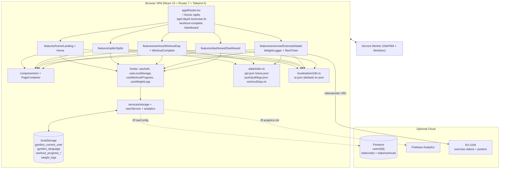

# 2. Architecture & Structure

## 2.1 Folder / file breakdown

```
D:\GymBro\
  index.html                  # <html lang="ar" dir="rtl">, #root, /src/main.tsx
  vite.config.ts              # @ alias, Tailwind, VitePWA manifest + workbox
  tsconfig.json               # strict TS, @/* → src/* (baseUrl ., bundler resolution)
  package.json                # dev, build (tsc -b && vite build), lint, preview
  .env.example                # 7x VITE_FIREBASE_* placeholders
  .gitignore                  # node_modules, dist, .env, *.local, skill-output.txt
  start.bat                   # Windows launcher: npx vite --host --port 5173
  public/
    _headers                  # Cloudflare Pages headers (nosniff, GIF/PNG MIME, immutable assets)
    favicon.svg, icon-192.svg, icon-512.svg
    exercises/*.gif           # 14 local GIF fallbacks
    icons/icon-192.png, icon-512.png
  scripts/
    check_video.py            # one-off: curl R2 MP4, inspect frames with imageio
    generate_gifs.py          # batch: curl R2 MP4s → crop → 480x360 15fps GIF (64 colors)
  src/
    main.tsx                  # StrictMode + createRoot + import ./localization/i18n
    App.tsx                   # Suspense spinner → <Router/>
    index.css                 # Tailwind v4 @theme tokens + base + utilities
    app/Router.tsx            # 7 routes + catch-all → /
    types/index.ts            # User, Split, WorkoutDay, Exercise, TechniqueSection, WeightLog, ...
    data/
      index.ts                # exerciseMap + getters
      workoutDays.ts          # 3 WorkoutDay objects (ppl/push, ppl/pull, ppl/legs)
      splits/ppl.json         # {id:ppl, enabled:true, days:[...]}
      splits/future.json      # 4 disabled splits (arnold, upper-lower, bro-split, full-body)
      exercises/push.json     # 5 exercises
      exercises/pull.json     # 5 exercises
      exercises/legs.json     # 6 exercises
    localization/
      i18n.ts                 # init, localStorage lang detection, dir switching
      locales/ar.json         # default + fallbackLng
      locales/en.json         # mirror structure
    services/
      firebase.ts             # lazy init app/db/analytics + hasConfig
      storage.ts              # getItem/setItem/removeItem with gymbro_ prefix
      userService.ts          # local user + Firestore users/stats
      analytics.ts            # logEvent wrappers
    hooks/
      useAuth.ts              # user state + login/updateUser/refreshLastActive
      useLocalStorage.ts      # generic useState+localStorage (raw keys, no prefix)
      useWorkout.ts           # useWorkoutProgress + useWeightLogs
    features/
      home/Landing.tsx        # entry + name capture
      home/Home.tsx           # split list
      splits/Splits.tsx       # PPL day list (hardcoded splitId 'ppl')
      workout/WorkoutDay.tsx  # checklist + progress
      workout/WorkoutComplete.tsx
      exercise/ExerciseDetails.tsx
      exercise/WeightLogger.tsx
      exercise/RestTimer.tsx
      dashboard/Dashboard.tsx
    components/
      layout/PageContainer.tsx
      ui/Button.tsx, Card.tsx, Badge.tsx, Checkbox.tsx, ProgressBar.tsx
    utils/                    # EMPTY (no files)
    assets/gifs/, assets/images/  # EMPTY (GIFs live in public/exercises/)
```

Path alias `@` → `./src` (`vite.config.ts:50-54`, `tsconfig.json:20-22`).

## 2.2 Data flow

**A. Identity (first run)**

```
Landing → getLocalUser() [key gymbro_current_user]
  ├─ exists → navigate('/home')
  └─ missing → useAuth.login(name) → userService.createUser()
       ├─ id = crypto.randomUUID(), now = Date.now()
       ├─ if hasConfig: setDoc(users/{id}, user).catch(()=>{})
       ├─ saveLocalUser(user)
       └─ trackVisit()  (analytics user_visit)
```

`useAuth.ts:9-13` fires `updateLastActive(user.id)` on every `user` identity change.

**B. Browse content (fully offline)**

```
Home → getAllSplits() → [ppl + 4 future]
Splits → getWorkoutDaysBySplit('ppl') → filter workoutDays.ts
WorkoutDay → useParams dayId → getWorkoutDayById(`ppl/${dayId}`) → getExercisesByWorkoutDay(day.id)
ExerciseDetails → useParams id → getExerciseById(id) → t(nameKey), t(technique.*)
```

Every domain object stores i18n keys (`nameKey`, `descriptionKey`, `primaryMuscleKey`, `technique.*`), resolved at render with `t(key)`.

**C. Session state (localStorage only)**

```
WorkoutDay → useWorkoutProgress(day.id)
  key workout_progress_{dayId}, value {dayId, date, completedExercises[], startTime, endTime?, completed}
ExerciseDetails → WeightLogger → useWeightLogs()
  key weight_logs, value [{exerciseId, date: YYYY-MM-DD, sets:[{setNumber, weight, reps}]}]
  all sets logged → onExerciseComplete() → toggleExercise(exercise.id)
WorkoutComplete (location.state {day, progress})
  → incrementWorkoutCompletion() → stats/workouts increment(1)
  → trackWorkoutComplete(day.id)
```

**D. Telemetry / dashboard (best-effort Firestore)**

```
getDashboardStats(): users.size, where(lastActiveAt >= midnight) count,
  orderBy(lastActiveAt desc) limit(10), stats/visits, stats/workouts.
mostViewedExercises always [].
```

## 2.3 Key design patterns

| Pattern | Where | Why |
|---|---|---|
| Feature colocation | `src/features/*` | Each route owns its UI; shared primitives in `components/ui` |
| Data-driven content | `src/data/**/*.json` + getters | Add exercise = JSON edit only (per `AGENTS.md`) |
| Indirect text via keys | `*Key` fields on all domain objects | AR/EN + RTL/LTR without code change |
| Local-first + graceful degradation | `hasConfig` + try/catch | Works with zero env config; Firebase only enhances |
| Prefixed sync storage | `services/storage.ts` (`gymbro_`) | Avoid collisions; JSON-safe silent fallback |
| Generic reactive storage | `hooks/useLocalStorage.ts` | `useState` + `localStorage` in one API |
| Atomic UI kit | `Button, Card, Badge, Checkbox, ProgressBar, PageContainer` | Consistent dark theme + motion; `Card` doubles as button when `onClick` set |
| PWA NetworkFirst | `vite.config.ts:37-46` | Offline-tolerant Firestore reads (50 entries / 24h) |
| Fire-and-forget telemetry | `analytics.ts`, `userService.ts` | Analytics must never break workout UX |

## 2.4 Architecture diagram


