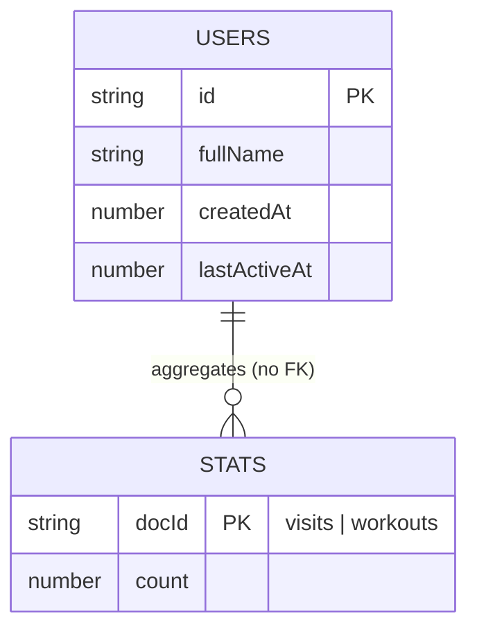

# 6. Database Schema

## 6.1 Firestore (cloud, optional)

```
users (collection)
  {id}  (doc id = crypto.randomUUID v4)
    id: string
    fullName: string
    createdAt: number (Date.now ms)
    lastActiveAt: number (Date.now ms)

stats (collection)
  visits (doc)
    count: number
  workouts (doc)
    count: number
```

Relationships: none (no subcollections, no references). `stats/*` are singleton counters.

Indexes/constraints:

- `where('lastActiveAt','>=',todayMidnight).orderBy('lastActiveAt','desc')` and `orderBy('lastActiveAt','desc').limit(10)` require a single-field index on `lastActiveAt` and list permission. Failures are swallowed → Dashboard zeros.
- No validation rules/uniqueness in repo (rules live in Firebase console, not versioned here).



## 6.2 localStorage (primary store — always active)

Prefix rule: `services/storage.ts` uses `gymbro_` prefix; `hooks/useLocalStorage.ts` uses **raw** keys (inconsistency, see `TECHNICAL-DEBT.md`).

| Key | Helper | Type | Writer |
|---|---|---|---|
| `gymbro_current_user` | storage.ts | `User` | `saveLocalUser` |
| `gymbro_language` | storage.ts via i18n.ts | `'ar' \| 'en'` | `languageChanged` handler |
| `workout_progress_{dayId}` e.g. `workout_progress_ppl/push` | useLocalStorage | `WorkoutProgress` | `toggleExercise`, `completeWorkout` |
| `weight_logs` | useLocalStorage | `WeightLog[]` | `logSet` (upsert per exercise + UTC-date + setNumber) |

Notes:

- `WeightLog.date` = UTC day (`toISOString().split('T')[0]`); late-night local sessions can bucket to the adjacent day.
- `WorkoutProgress.date`/`startTime` are set once when the key is created and never reset.
